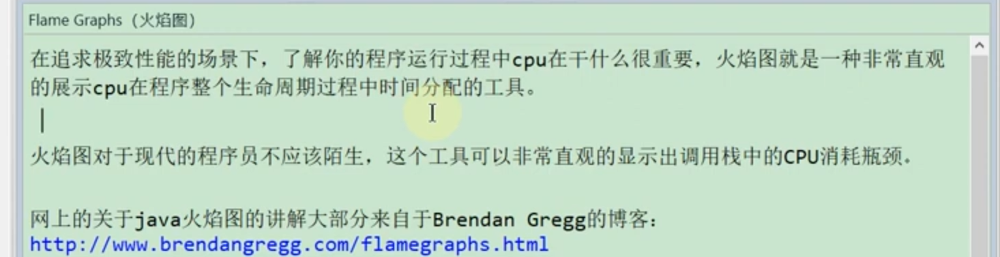
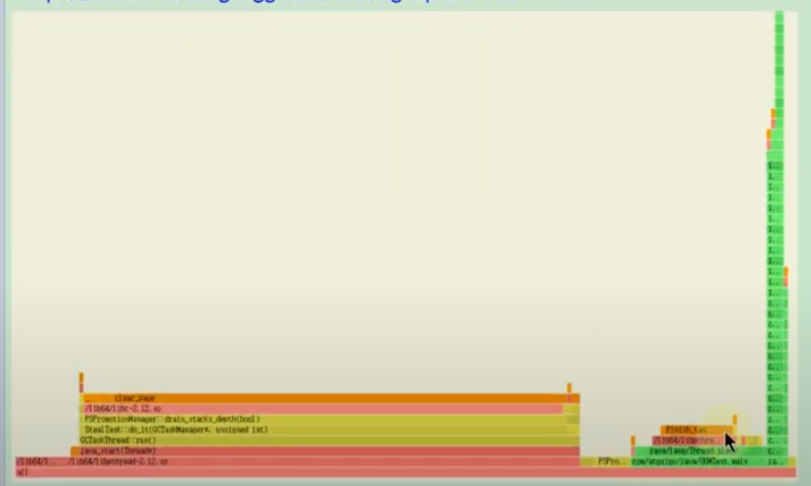

# 如何看懂火焰图

[60 火焰图的使用介绍 (youtube.com)](https://www.youtube.com/watch?v=5SnLicmWHh4)

横轴就是时间

# 最官方的教程：Brendan Gregg 的博客

[Flame Graphs (brendangregg.com)](https://www.brendangregg.com/flamegraphs.html)

Flame graphs are a visualization of hierarchical data, created to visualize stack traces of profiled software so that the most frequent code-paths to be identified quickly and accurately. They can be generated using my open source programs on [github.com/brendangregg/FlameGraph](https://github.com/brendangregg/FlameGraph), which create interactive SVGs. My colleague on the Netflix performance engineering team, Martin Spier, created an open source d3 version: [d3-flame-graph](https://github.com/spiermar/d3-flame-graph). See the [Updates](https://www.brendangregg.com/flamegraphs.html#Updates) section for other implementations.

